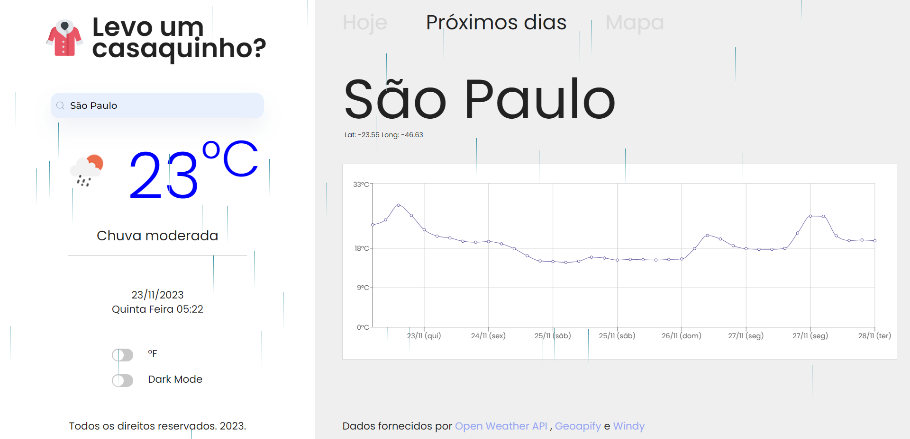
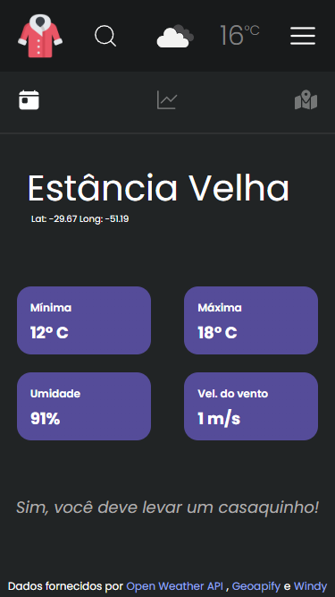
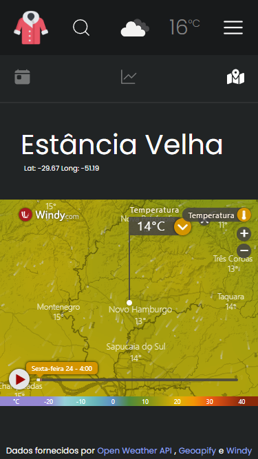

# 🌦️ Mom Weather


Mom Weather is a front-end web application designed to alleviate the stress of dressing appropriately for any given location. By simply entering the name of a city, users can access comprehensive weather information, including the current temperature, maximum and minimum temperatures, temperature map, and a forecast for the upcoming days.

# :rocket: Demo
### [Link to demo](https://mom-weather.vercel.app/)

</br>
</br>

# :bookmark: Previews
</br>

### The website is fully responsive on across all screen sizes

## :computer: Desktop
<div align="center">
    
   </br>
    </br>
    
   </br>
   </br>
   
   </br>
   </br>
   
</div>

## :newspaper: Tablet

   </br>
      </br>
 
    </br>
       </br>

## :iphone: Mobile 
<div align="center">
    
   
   
</div>

</br>

# 💻 Tech Used
For this project i used:

- Framework [React v.18.2.0](https://react.dev/learn)
- Tool [Vite](https://vitejs.dev/)
- Language [Typescript](https://www.typescriptlang.org/)
- CSS Styles [styled-components](https://www.npmjs.com/package/styled-components)
- Responsivity [@uidotdev/usehooks](https://www.npmjs.com/package/@uidotdev/usehooks)
- Animations [animate.css](https://www.npmjs.com/package/animate.css)
- Icons [react-icons](https://www.npmjs.com/package/react-icons)
- API Calls [react-query](https://www.npmjs.com/package/react-query)
- Routing [react-router-dom](https://www.npmjs.com/package/react-router-dom)
- Graph [recharts](https://www.npmjs.com/package/recharts)
- Notification pop-ups [sweetalert2](https://www.npmjs.com/package/sweetalert2)
- HTTP Requests [axios](https://www.npmjs.com/package/axios)

# :bookmark_tabs: API's Used

- Forecasts and weather [Open Weather](https://openweathermap.org/api)
- Geolocation based on text [Geoapify](https://apidocs.geoapify.com/)
- Maps [Windy](https://www.windy.com/)

# :wrench: Installation and Running
To run Mom Weather on your local machine or server, follow these steps:

</br>

- Open up your command line 

</br>

1. Clone this repository:
```bash 
git clone https://github.com/DarlanSchwartz/Mom-Weather
```
2. Navigate to the project directory:
```bash 
cd Mom-Weather
```
3. Install the required dependencies
```bash 
npm install
```

4. Create a [.env]() file and fill the variables with your api keys, follow this [.env.example](.env.example) file for examples
```properties
VITE_WEATHER_API_KEY=your_open_weather_api_key_here
VITE_GEOCODE_API_KEY=your_geoapify_api_key_here
VITE_GEOCODE_API_LINK=https://www.geoapify.com/
VITE_WEATHER_API_LINK=https://openweathermap.org/
VITE_MIN_TEMP_TO_FREEZE=minimum_temperature_to_wear_a_jacket_here => 17
VITE_MAP_API_LINK=https://www.windy.com/
```
5. Run the project

```bash 
npm run dev
```
6. Open http://localhost:5173/ :ballot_box_with_check: